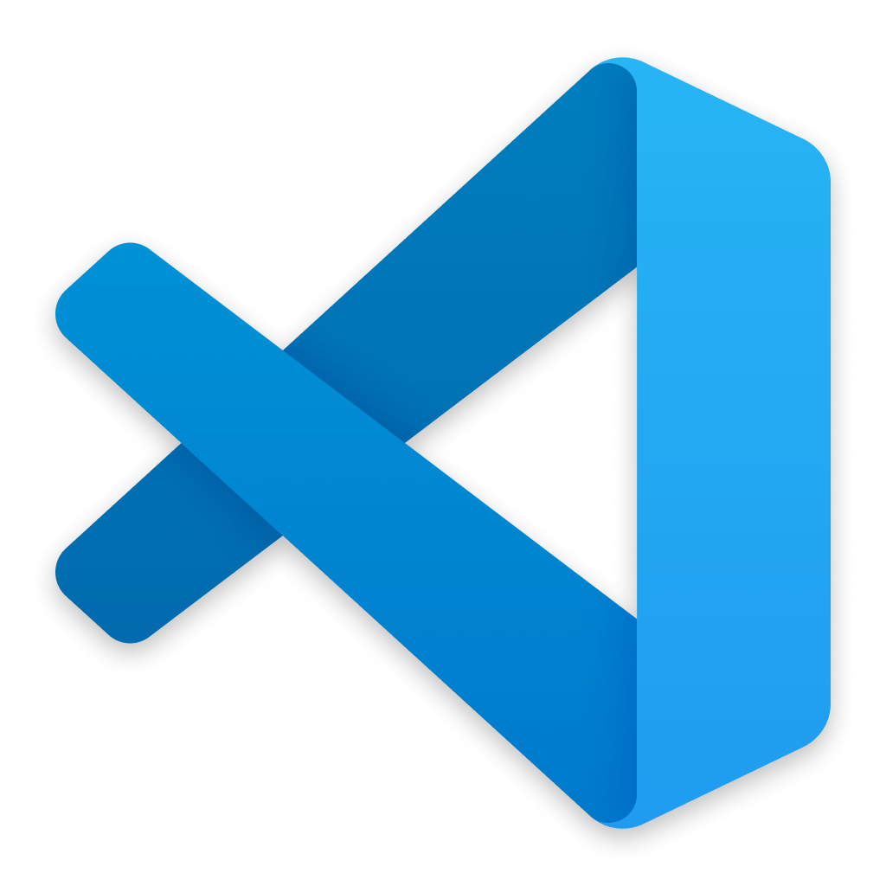

# VSCode Dotfiles

<p align="center">
  
</p>

<p align="center">
  <h4 align="center">Curated configuration ("dotfiles") for an opinionated Visual Studio Code setup</h4>
  <p align="center"><strong>Tested on:</strong> Linux x64, arm64 and x86</p>
</p>

## Why this repo?

- Keep your VS Code settings, keybindings, snippets and extensions **under version control**.  
- **One-command bootstrap** on a fresh machine: run `setup.sh` and start coding.  
- **Portable**: works alongside your package-manager, Flatpak or manual VS Code installation.  
- No sudo required – everything lives in `$HOME`.

## Dotfiles included

| Path inside repo | Symlink target on disk |
|------------------|------------------------|
| `settings.json`  | `~/.config/Code/User/settings.json` |
| `keybindings.json` | `~/.config/Code/User/keybindings.json` |
| `snippets/` | `~/.config/Code/User/snippets/` |
| `extensions.txt` | list of extensions to install via `code --install-extension` |

Feel free to add themes, icon sets or custom tasks and launch configs.

## Quick start

1. **Clone** the repo:

```bash
git clone https://github.com/void-land/vscode-dots.git ~/.vscode-dots
cd ~/.vscode-dots
```

2. **Run the setup script** (creates symlinks and installs extensions):

3. Restart VS Code. Your personalized environment is ready!
