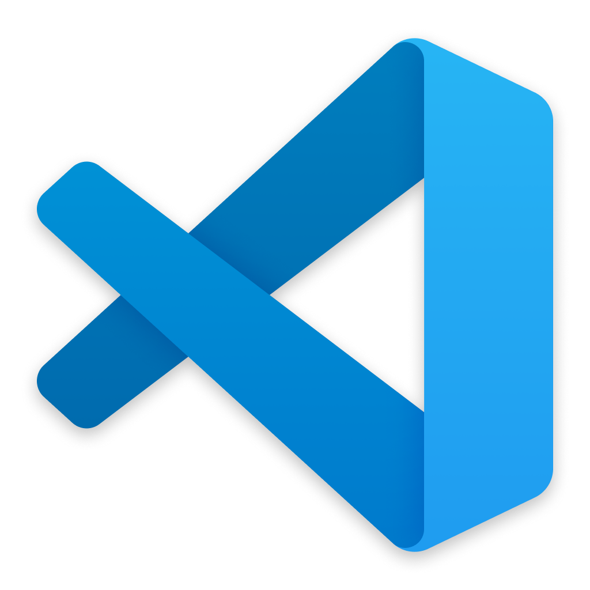

# VSCode Dotfiles

<p align="center">
  
</p>

<p align="center">
  <h4 align="center">Curated configuration ("dotfiles") for an opinionated Visual Studio Code setup</h4>
  <p align="center"><strong>Tested on:</strong> Linux x64, arm64 and x86</p>
</p>

## Why this repo?

- Keep your VS Code settings, keybindings, snippets and extensions **under version control**.  
- **One-command bootstrap** on a fresh machine: run `setup.sh` and start coding.  
- **Portable**: works alongside your package-manager, Flatpak or manual VS Code installation.  
- No sudo required – everything lives in `$HOME`.

## Dotfiles included

| Path inside repo | Symlink target on disk |
|------------------|------------------------|
| `settings.json`  | `~/.config/Code - OSS/User/settings.json` and `~/.config/VSCodium/User/settings.json` |
| `keybindings.json` | `~/.config/Code - OSS/User/keybindings.json` and `~/.config/VSCodium/User/keybindings.json`|
| `snippets/` | `~/.config/Code - OSS/User/snippets/` and `~/.config/VSCodium/User/snippets/`|

## Quick start

1. **Clone** the repo:

```bash
git clone https://github.com/void-land/vscode-dots.git ~/.vscode-dots
cd ~/.vscode-dots
```

1. **Link the configurations:**
Run the `stow.sh` script to securely symlink the configs from this repository into your system's VS Code / VSCodium directories.

```bash
./stow.sh -s
```

1. **Install extensions:**
Install your offline `.vsix` extensions using the extension manager.

```bash
./extension.sh -v
```

1. **Restart VS Code**. Your personalized environment is ready!

---

## Managing Configuration (`stow.sh`)

The `stow.sh` script manages the symlinking of configuration files (settings, snippets, keybindings) from the repository's `configs/` folder directly to the application config directories for **VS Code OSS** and **VSCodium**.

**Link (Stow) Configurations:**

```bash
./stow.sh -s
```

*This creates the necessary directories in `~/.config/` and symlinks the files.*

**Unlink (Unstow) Configurations:**

```bash
./stow.sh -u
```

*This removes the symlinks from your system, detaching VS Code from this repository.*

---

## Managing Extensions (`extension.sh`)

The `extension.sh` script is a powerful utility for fetching, downloading, and installing VS Code extensions from Open VSX, especially useful for offline setups or avoiding rate limits. It reads the desired extensions from `oss-extensions.txt`.

### Prerequisites

Before downloading extensions, ensure you have the required dependencies installed on your system:

- `curl`
- `jq`

### Installing Existing Extensions

If you already have `.vsix` files downloaded in the `downloads/` directory, you can install them locally without needing an internet connection:

```bash
./extension.sh -v
```

*This detects your VS Code binary (`code`, `code-insiders`, or `codium`) and installs the extensions, creating an `install.log`.*

### Downloading Extensions

To fetch extension info and download the `.vsix` files from scratch:

**Concurrent Download (Recommended - Faster)**
Downloads up to 20 files in parallel using `curl`:

```bash
./extension.sh -p
```

**Sequential Download (Fallback)**

```bash
./extension.sh -d
```

**Complete Automated Setup**
Fetches info, downloads concurrently, installs locally, and lists summaries in one go:

```bash
./extension.sh -c
```

### Downloading Using a Proxy

If you are behind a restricted network, you can route the script's `curl` requests through a proxy using environment variables.

**Using an HTTP/HTTPS Proxy:**

```bash
http_proxy=http://127.0.0.1:8080 https_proxy=http://127.0.0.1:8080 ./extension.sh -p
```

**Using a SOCKS5 Proxy:**
*(The `socks5h://` scheme forces DNS resolution through the proxy, which is often necessary)*

```bash
ALL_PROXY=socks5h://127.0.0.1:1080 ./extension.sh -p
```
